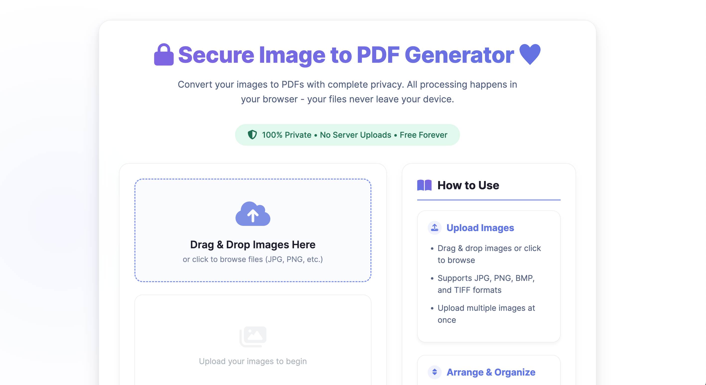

# Secure Image to PDF Converter

A modern, privacy-focused web application that converts your images to PDFs entirely in your browser. Your files never leave your device - no server uploads, no privacy concerns.

## Features

- **100% Client-Side Processing**: All conversion happens in your browser
- **Military-Grade Privacy**: Your images never leave your computer
- **Drag & Drop Interface**: Easily upload and rearrange images
- **Premium Design**: Modern aesthetic with beautiful gradients
- **Image Management**: Reorder, preview, and remove images
- **PDF Quality Preservation**: Maintains original image quality
- **Completely Free**: No subscriptions, no watermarks, no limits

## How It Works

1. **Upload Images**: Drag & drop or browse to select your images
2. **Arrange**: Drag thumbnails to reorder images in your PDF
3. **Convert**: Click "Convert to PDF" to process images in your browser
4. **Download**: Your PDF downloads automatically - no server involved

## Privacy Guarantee

🔒 **Your security is our priority**:
- All processing happens locally in your browser
- Zero server uploads - your files never leave your computer
- No tracking, no analytics, no data collection
- Open source code for complete transparency

## Technology Stack

- **Frontend**: HTML5, CSS3 (with modern gradients and glassmorphism), JavaScript
- **PDF Generation**: [PDF-Lib.js](https://pdf-lib.js.org/)
- **Drag & Drop**: [Sortable.js](https://sortablejs.github.io/Sortable/)
- **Icons**: [Font Awesome](https://fontawesome.com)

## Why Choose This Tool?

| Feature          | Our Tool       | Other Converters        |
|------------------|----------------|-------------------------|
| Privacy          | ✅ 100% secure | ❌ Server uploads       |
| Cost             | ✅ Completely free | ❌ Often paid         |
| Watermarks       | ✅ None        | ❌ Frequently added     |
| Speed            | ✅ Instant     | ❌ Server processing    |
| File Access      | ✅ None        | ❌ Often retain files   |

## Getting Started

Simply open the HTML file in any modern browser:

```bash
open index.html  # On macOS
start index.html # On Windows
```

Or [use the live demo](https://ansarissab.github.io/free-secure-image-to-pdf-generator/) (coming soon)

## Development

To contribute to this project:

1. Clone the repository:
```bash
git clone https://github.com/Ansarissab//free-secure-image-to-pdf-generator.git
```

2. Open the project directory:
```bash
cd free-secure-image-to-pdf-generator
```

3. Open `index.html` in your browser

## Screenshots



## Support

For support, feature requests, or to report issues, please [open an issue](https://github.com/yourusername/image-to-pdf-converter/issues).

## License

This project is licensed under the MIT License - see the [LICENSE](LICENSE) file for details.

---

**Your privacy matters.** This tool was built to provide a secure alternative to cloud-based converters that risk your sensitive documents. Bookmark it, share it, and enjoy truly private conversions forever.
